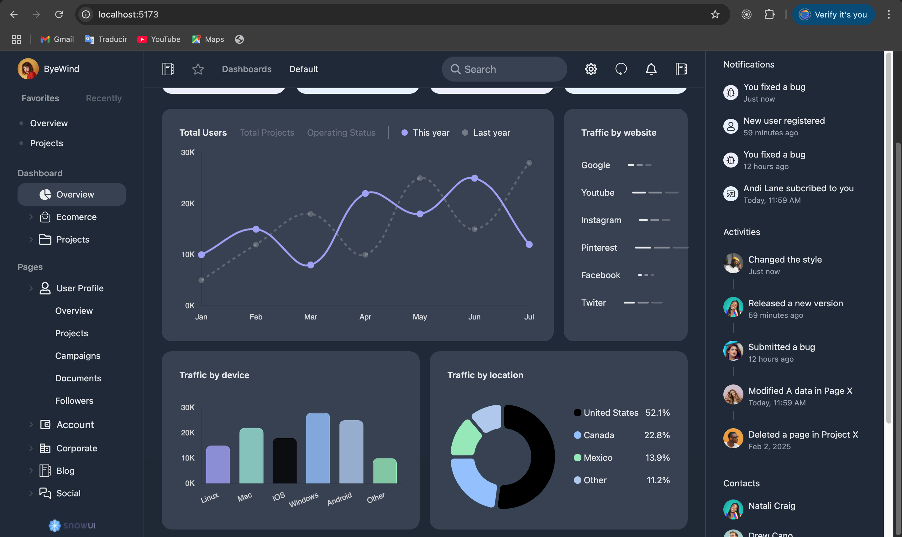
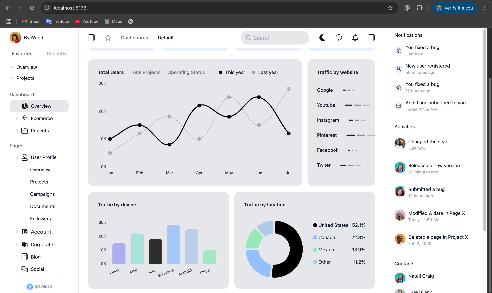

##  🧐 Admin Dashboard

> This is a page made with React.Js and Tailwind css framework, it has a light and dark theme and 3 types of charts.




## 🔧 Built With

- React.Js
- Tailwind (CSS)
- Charts.Js and react-chartjs-2
- Gemini (Gemini only to ask questions, but is not integrated in the project, mostly used to build the charts part)

## 🔴 Live Demo

[Live Demo](https://venerable-sorbet-31bcd6.netlify.app/)


## 🛠 Getting Started

To get a local copy up and running follow these simple example steps.

- Go to the main page of te repo.
- Press the ```Code``` button and get the repo link.
- Clone it using git.

## ✒️ Authors

👤 **Cecilia Benitez**

- [@Ceci007](https://github.com/Ceci007)


## 🤝 Contributing

Contributions, issues and feature requests are welcome!

Feel free to check the [issues page](https://github.com/Ceci007/react-dashboard/issues).

## 📝 License

This project is [MIT](lic.url) licensed.
